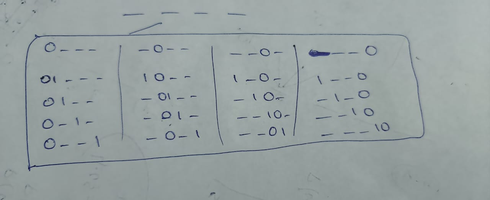

# [473. Matchsticks to Square (Medium)](https://leetcode.com/problems/matchsticks-to-square/)

<p>You are given an integer array <code>matchsticks</code> where <code>matchsticks[i]</code> is the length of the <code>i<sup>th</sup></code> matchstick. You want to use <strong>all the matchsticks</strong> to make one square. You <strong>should not break</strong> any stick, but you can link them up, and each matchstick must be used <strong>exactly one time</strong>.</p>

<p>Return <code>true</code> if you can make this square and <code>false</code> otherwise.</p>

<p>&nbsp;</p>
<p><strong>Example 1:</strong></p>

<pre><strong>Input:</strong> matchsticks = [1,1,2,2,2]
<strong>Output:</strong> true
<strong>Explanation:</strong> You can form a square with length 2, one side of the square came two sticks with length 1.
</pre>

<p><strong>Example 2:</strong></p>

<pre><strong>Input:</strong> matchsticks = [3,3,3,3,4]
<strong>Output:</strong> false
<strong>Explanation:</strong> You cannot find a way to form a square with all the matchsticks.
</pre>

<p>&nbsp;</p>
<p><strong>Constraints:</strong></p>

<ul>
	<li><code>1 &lt;= matchsticks.length &lt;= 15</code></li>
	<li><code>1 &lt;= matchsticks[i] &lt;= 10<sup>8</sup></code></li>
</ul>


**Related Topics**:  
[Array](https://leetcode.com/tag/array/), [Dynamic Programming](https://leetcode.com/tag/dynamic-programming/), [Backtracking](https://leetcode.com/tag/backtracking/), [Bit Manipulation](https://leetcode.com/tag/bit-manipulation/), [Bitmask](https://leetcode.com/tag/bitmask/)

## Solution 1. Bitmask DP on Subsets

```cpp
// OJ: https://leetcode.com/problems/partition-to-k-equal-sum-subsets/
// Author: github.com/lzl124631x
// Time: O(N * 2^N)
// Space: O(2^N)
class Solution {
    public:
        bool canPartitionKSubsets(vector<int>& A, int k) {
            // Calculate total sum and check divisibility by k
            int sum = accumulate(begin(A), end(A), 0);
            if (sum % k) return false; // Not divisible, impossible to partition
            int N = A.size();
            sum /= k; // Target sum per subset
            vector<int> dp(1 << N, -1); // DP table: -1 unvisited, 0/1 visited
            dp[(1 << N) - 1] = 1; // All elements used, valid partition
            sort(begin(A), end(A), greater<>()); // Prioritize larger numbers
    
            // Start DFS with initial mask and target sum
            return dfs(A, dp, sum, N, 0, sum);
        }
    
        // Recursive DFS with memoization
        bool dfs(const vector<int>& A, vector<int>& dp, int sum, int N, int mask, int target) {
            // Memoization: Return cached result if available
            if (dp[mask] != -1) return dp[mask];
            dp[mask] = 0; // Assume cannot partition initially
    
            // ** Reset target if current subset is complete
            if (target == 0) target = sum;
    
            // ** Try adding each element to the current subset  [different from the other approach]
            for (int i = 0; i < N && !dp[mask]; ++i) {      
                // ** !dp[mask] = 1 means no selection is possible using this type - For 2nd time, we can use the info from 1st time
                if ((mask >> i & 1) || A[i] > target) continue; // Skip used or too large elements
                dp[mask] = dfs(A, dp, sum, N, mask | (1 << i), target - A[i]);
            }
            return dp[mask]; // Return whether a valid partition is found
        }
    };
```

## Solution 2. Backtrack to Fill Buckets

Let `target = sum(A) / 4`, which is the target length of each edge.

We use DFS to try to fill each `A[i]` into different edges.

Two optimizations here:

1. The `unordered_set<int> seen` is used to prevent handling the same edge value again. For example, assume `edge = [1, 1, 1, 1]`, and now we are trying to add a stick of length `2` to it. Adding `2` to either `1` will yield the same result. So we just need to add to a edge with length `1` once.
1. Sorting the sticks in descending order will make it converge faster because it's easy to fill in sands but hard to fill in peddles; filling peddles first will fail faster.


```cpp
// OJ: https://leetcode.com/problems/partition-to-k-equal-sum-subsets/
// Author: github.com/lzl124631x
// Time: O(K^N)
// Space: O(N * SUM(A) / K)

class Solution {
    public:
        bool canPartitionKSubsets(vector<int>& A, int k) {
            // Calculate total sum and check divisibility by k
            int sum = accumulate(begin(A), end(A), 0), N = A.size();
            if (sum % k) return false; // Not divisible, impossible to partition
            sum /= k; // Target sum per subset
            sort(begin(A), end(A), greater<>()); // Prioritize larger numbers
    
            vector<int> s(k); // Initialize subset sums
    
            // Start DFS from the first element
            return dfs(A, s, sum, N, k, 0);
        }
    
        // Recursive DFS function to try assignments
        bool dfs(const vector<int>& A, vector<int>& s, int sum, int N, int k, int i) {
            // Base case: All elements assigned
            if (i == N) return true;
    
            // ** Try assigning the current element to each subset [Diiffernt in the next approach]
            for (int j = 0; j < k; ++j) {
                if (s[j] + A[i] > sum) continue; // Exceeds target sum, skip
                s[j] += A[i]; // Tentatively add to subset
                if (dfs(A, s, sum, N, k, i + 1)) return true; // Recursively try next elements
                s[j] -= A[i]; // Backtrack if assignment fails
                if (s[j] == 0) break; // Avoid trying empty subsets again
            }
            return false; // No valid assignment found
        }
    };
    


```
