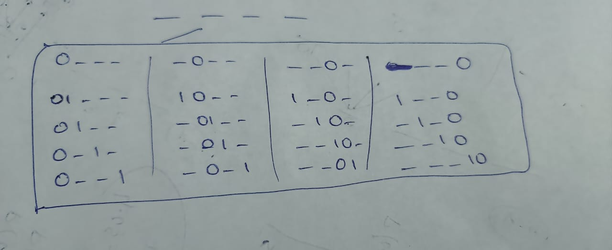

# [698. Partition to K Equal Sum Subsets (Medium)](https://leetcode.com/problems/partition-to-k-equal-sum-subsets/)

<p>Given an array of integers <code>nums</code> and a positive integer <code>k</code>, find whether it's possible to divide this array into <code>k</code> non-empty subsets whose sums are all equal.</p>

<p>&nbsp;</p>

<p><b>Example 1:</b></p>

<pre><b>Input:</b> nums = [4, 3, 2, 3, 5, 2, 1], k = 4
<b>Output:</b> True
<b>Explanation:</b> It's possible to divide it into 4 subsets (5), (1, 4), (2,3), (2,3) with equal sums.
</pre>

<p>&nbsp;</p>

<p><b>Note:</b></p>

<ul>
	<li><code>1 &lt;= k &lt;= len(nums) &lt;= 16</code>.</li>
	<li><code>0 &lt; nums[i] &lt; 10000</code>.</li>
</ul>


**Related Topics**:  
[Dynamic Programming](https://leetcode.com/tag/dynamic-programming/), [Recursion](https://leetcode.com/tag/recursion/)

**Similar Questions**:
* [Partition Equal Subset Sum (Medium)](https://leetcode.com/problems/partition-equal-subset-sum/)

## Note

This problem is very similar to [473. Matchsticks to Square (Medium)](https://leetcode.com/problems/matchsticks-to-square/).

## Solution 1. Bitmask DP on Subsets

```cpp
// OJ: https://leetcode.com/problems/partition-to-k-equal-sum-subsets/
// Author: github.com/lzl124631x
// Time: O(N * 2^N)
// Space: O(2^N)
class Solution {
    public:
        bool canPartitionKSubsets(vector<int>& A, int k) {
            // Calculate total sum and check divisibility by k
            int sum = accumulate(begin(A), end(A), 0);
            if (sum % k) return false; // Not divisible, impossible to partition
            int N = A.size();
            sum /= k; // Target sum per subset
            vector<int> dp(1 << N, -1); // DP table: -1 unvisited, 0/1 visited
            dp[(1 << N) - 1] = 1; // All elements used, valid partition
            sort(begin(A), end(A), greater<>()); // Prioritize larger numbers
    
            // Start DFS with initial mask and target sum
            return dfs(A, dp, sum, N, 0, sum);
        }
    
        // Recursive DFS with memoization
        bool dfs(const vector<int>& A, vector<int>& dp, int sum, int N, int mask, int target) {
            // Memoization: Return cached result if available
            if (dp[mask] != -1) return dp[mask];
            dp[mask] = 0; // Assume cannot partition initially
    
            // ** Reset target if current subset is complete
            if (target == 0) target = sum;
    
            // ** Try adding each element to the current subset  [different from the other approach]
            for (int i = 0; i < N && !dp[mask]; ++i) {      
                // ** !dp[mask] = 1 means no selection is possible using this type - For 2nd time, we can use the info from 1st time
                if ((mask >> i & 1) || A[i] > target) continue; // Skip used or too large elements
                dp[mask] = dfs(A, dp, sum, N, mask | (1 << i), target - A[i]);
            }
            return dp[mask]; // Return whether a valid partition is found
        }
    };
```

## Solution 2. Backtrack to Fill Buckets 


```cpp
// OJ: https://leetcode.com/problems/partition-to-k-equal-sum-subsets/
// Author: github.com/lzl124631x
// Time: O(K^N)
// Space: O(N * SUM(A) / K)

class Solution {
    public:
        bool canPartitionKSubsets(vector<int>& A, int k) {
            // Calculate total sum and check divisibility by k
            int sum = accumulate(begin(A), end(A), 0), N = A.size();
            if (sum % k) return false; // Not divisible, impossible to partition
            sum /= k; // Target sum per subset
            sort(begin(A), end(A), greater<>()); // Prioritize larger numbers
    
            vector<int> s(k); // Initialize subset sums
    
            // Start DFS from the first element
            return dfs(A, s, sum, N, k, 0);
        }
    
        // Recursive DFS function to try assignments
        bool dfs(const vector<int>& A, vector<int>& s, int sum, int N, int k, int i) {
            // Base case: All elements assigned
            if (i == N) return true;
    
            // ** Try assigning the current element to each subset [Diiffernt in the next approach]
            for (int j = 0; j < k; ++j) {
                if (s[j] + A[i] > sum) continue; // Exceeds target sum, skip
                s[j] += A[i]; // Tentatively add to subset
                if (dfs(A, s, sum, N, k, i + 1)) return true; // Recursively try next elements
                s[j] -= A[i]; // Backtrack if assignment fails
                if (s[j] == 0) break; // Avoid trying empty subsets again
            }
            return false; // No valid assignment found
        }
    };
    


```
