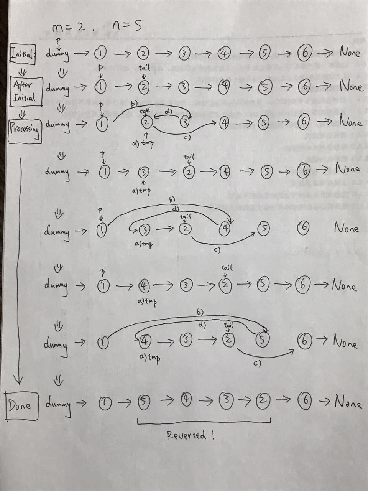

# [92. Reverse Linked List II (Medium)](https://leetcode.com/problems/reverse-linked-list-ii/)

<p>Given the <code>head</code> of a singly linked list and two integers <code>left</code> and <code>right</code> where <code>left &lt;= right</code>, reverse the nodes of the list from position <code>left</code> to position <code>right</code>, and return <em>the reversed list</em>.</p>

<p>&nbsp;</p>
<p><strong>Example 1:</strong></p>

<pre><strong>Input:</strong> head = [1,2,3,4,5], left = 2, right = 4
<strong>Output:</strong> [1,4,3,2,5]
</pre>

<p><strong>Example 2:</strong></p>

<pre><strong>Input:</strong> head = [5], left = 1, right = 1
<strong>Output:</strong> [5]
</pre>

<p>&nbsp;</p>
<p><strong>Constraints:</strong></p>

<ul>
	<li>The number of nodes in the list is <code>n</code>.</li>
	<li><code>1 &lt;= n &lt;= 500</code></li>
	<li><code>-500 &lt;= Node.val &lt;= 500</code></li>
	<li><code>1 &lt;= left &lt;= right &lt;= n</code></li>
</ul>

<p>&nbsp;</p>
<strong>Follow up:</strong> Could you do it in one pass?

**Companies**:  
[Microsoft](https://leetcode.com/company/microsoft), [Amazon](https://leetcode.com/company/amazon), [Facebook](https://leetcode.com/company/facebook), [Bloomberg](https://leetcode.com/company/bloomberg)

**Related Topics**:  
[Linked List](https://leetcode.com/tag/linked-list/)

**Similar Questions**:
* [Reverse Linked List (Easy)](https://leetcode.com/problems/reverse-linked-list/)



## Solution 1.

```cpp
// OJ: https://leetcode.com/problems/reverse-linked-list-ii/
// Author: github.com/lzl124631x
// Time: O(N)
// Space: O(1)

class Solution {
public:
    ListNode* reverseBetween(ListNode* head, int m, int n) {
        if (!head || m == n) return head;
        
        ListNode dummy(0);
        dummy.next = head;
        ListNode* p = &dummy;
        
        // Move p to the node before the start of the reversal
        for (int i = 0; i < m - 1; i++) {
            p = p->next;
        }
        
        ListNode* tail = p->next;
        
        // Reverse the nodes between m and n
        for (int i = 0; i < n - m; i++) {
            ListNode* tmp = p->next;         // a)
            p->next = tail->next;            // b)
            tail->next = tail->next->next;   // c)
            p->next->next = tmp;             // d)
        }
        
        return dummy.next;
    }
};

```
